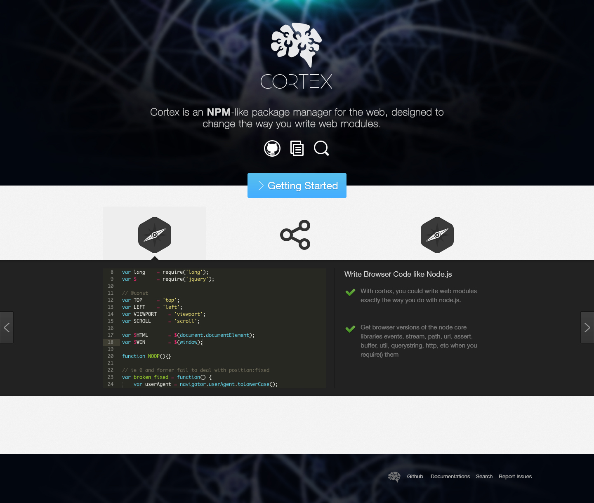

# Design of cortexjs.org

By [i@kael.me](mailto:i@kael.me).




## Search input syntax

```
[<action>:]<param>[|<action>:<param>[|<action>|<param>]]
```

如果 `action` 没有定义，则默认为综合搜索。

#### Search by keywords

```
keywords:dom
```

#### Piped search query

```
keywords:ajax|descend:stars|limit:30
```

按 `package.keywords` 进行搜索，并按照 star 数目降序排序，并仅显示前三个结果


### Available actions

- keywords：按关键字搜索
- name：按名称搜索 


## 搜索页响应式设计说明

见 `search.psd`

设计分为三栏：

- A：搜索结果栏
- B：内容栏
- C：信息栏

如果用户直接进入具体项目页面，则不显示 A。比如 `name:jquery`

如果屏幕宽度小于某一个临界值，则 C 显示到 B 栏目的 README 板块 之前。

README 板块（markdown）的内容暂时直接扒 github 或者什么的样式。

C 栏目，dependencies 和 dependents 的样式与 keywords 板块相同。

